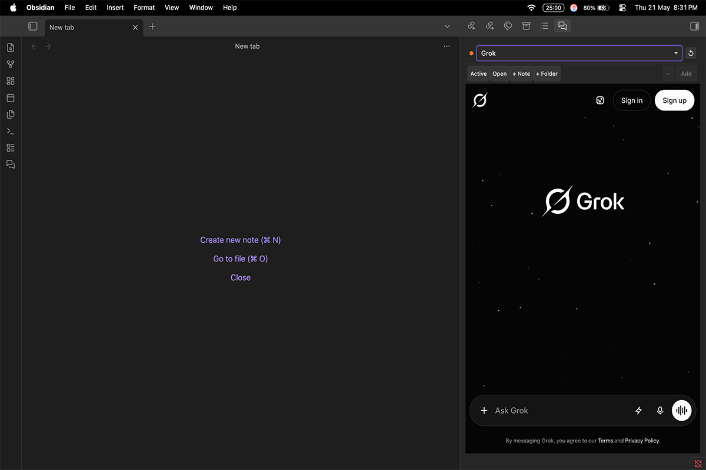
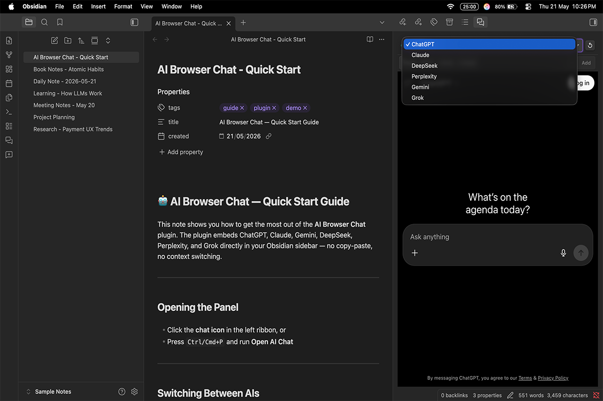
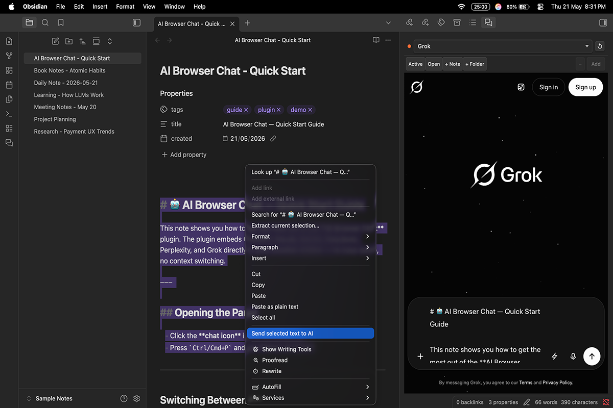

# AI Browser Chat

> Embed ChatGPT, Claude, Gemini, Grok, DeepSeek and Perplexity in an Obsidian sidebar — and send vault notes or selected text directly into the chat.

**Desktop only · macOS · Windows · Linux**

---

---

## Features

- **6 AI services in one panel** — ChatGPT, Claude, DeepSeek, Perplexity, Gemini, Grok. Switch instantly from the dropdown.
- **Send selected text** — select anything in a note, run the command, and it lands in the AI input.
- **Vault context** — add notes or whole folders as context and click **Add** to inject them.
- **Persistent sessions** — stays logged in across Obsidian restarts.
- **Toggle hotkey** — open/close the sidebar from a keyboard shortcut you assign.
- **Auto-refresh, context prefix, per-service toggles** — see [Settings](docs/settings.md).

---

## Screenshots

### Switch between AI services

### Send selected text to AI

---

## Installation

See **[docs/installation.md](docs/installation.md)** — community plugin store, manual install, and BRAT.

---

## Documentation

| Guide | |
|---|---|
| [Installation](docs/installation.md) | Community store, manual, and BRAT |
| [Settings](docs/settings.md) | All plugin settings and commands |
| [Development](docs/development.md) | Local setup, build, and debugging |
| [Architecture](docs/architecture.md) | Data flow and design decisions |
| [Contributing](docs/contributing.md) | How to contribute |

---

## Privacy

AI Browser Chat does not collect, transmit, or store any personal data. See [PRIVACY.md](PRIVACY.md).

## Disclaimer

Independent, unofficial plugin — not affiliated with OpenAI, Anthropic, Google, xAI, DeepSeek, Perplexity, or Obsidian. All product names are trademarks of their respective owners.

## License

MIT — see [LICENSE.txt](LICENSE.txt).
